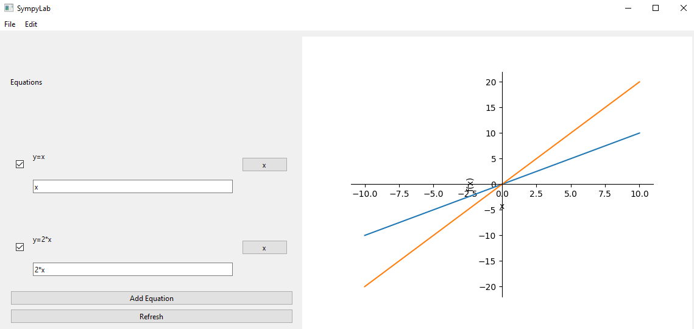

# SympyLab

[](https://github.com/zwang20/SympyLab/actions/workflows/codeql-analysis.yml)



A platform agnostic GUI mathematical solver making use of the [SymPy library](https://www.sympy.org/).

Features

- Graph relations between x and y on a coordinate plane
- Simplify expressions

In the future it will be able to:

- Solve equations
- Render LaTeX expressions

## Setup

Requirements

- Python
- Pip

Run the following line to install dependencies using `pip`:

```shell
pip install -r requirements.txt
```
